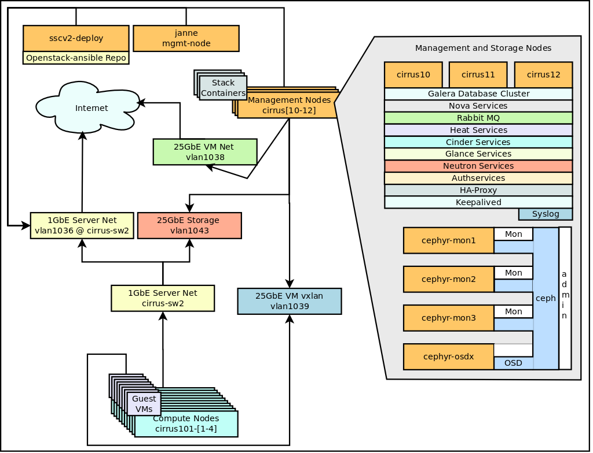

# Openstack Rocky Deployment at C3SE

## General

Openstack Ansible was used for the Openstack deployment at C3SE.

    git clone https://git.openstack.org/openstack/openstack-ansible
    git checkout stable/rocky

## System map

## Hardware setup

### Compute nodes x 4

- Intel servers
- 2 x 16 Core Intel(R) Xeon(R) Gold CPU 6130
- 196 GB RAM
- 1 x 450G SSD Disk

### Control nodes x 3

- Super Micro servers
- 2 x 20 Core Intel(R) Xeon(R) Silver 4114
- 196G RAM
- 2 x 250G SSD Disks in a RAID 1 mirror.

### Storage nodes x 13

- Super Micro servers
- 2 x 16 Core Intel(R) Xeon(R) Silver 4216 CPU
- 384G RAM
- 24 x 10T
- 300T for reserved for SSC Ceph storage

## Node setup

All nodes run Ubuntu 18.04 and they are installed with Cobbler, the C3SE standard for server installation.

### Compute node post cobbler stuff

All stuff is not yet fixed with cobbler so after the initial installation of the host has completed we need to run some ansible playbook to set things up.

    # Prepare nodes pre openstack-ansible
    ansible-playbook setup-ssc.yml

## Openstack Ansible

The host sscv2-deploy is deployment-host for openstack-ansible.
SSH is used for access to destination hosts. SSH-Keys are used for containers.

The rest of the setup follows openstack-ansible refrence manual for installation.

The following configuraton files were used for deployment.

- [openstack_user_config.yml](c3se_conf/openstack_user_config.yml)
- [user_variables.yml](c3se_conf/user_variables.yml)

## Network

Linux-bridges are used for the for the vlan, storage and vxlan traffic.

### Management node interfaces

/etc/network/interfaces.d/lxc-net-bridge.cfg

    auto lxcbr0
    iface lxcbr0 inet static
        address 10.0.3.1
        netmask 255.255.255.0
        # dnsmasq start and stop
        post-up /usr/local/bin/lxc-system-manage iptables-create
        post-up /usr/local/bin/lxc-system-manage dnsmasq-start || true
        post-down /usr/local/bin/lxc-system-manage iptables-remove
        post-down /usr/local/bin/lxc-system-manage dnsmasq-stop
        bridge_fd 0
        bridge_maxwait 0
        bridge_ports none
        bridge_hello 2
        bridge_maxage 12
        bridge_stp off

/etc/network/interfaces

    auto lo
    iface lo inet loopback

    # The primary network interface
    auto eno1
    iface eno1 inet manual

/etc/network/interfaces.d/br-mgmt.cfg

    auto br-mgmt
    iface br-mgmt inet static
           bridge_ports eno1
           address 10.38.1.170
           netmask 255.255.0.0

/etc/network/interfaces.d/bond0-1039.cfg

    auto br-vxlan
    iface br-vxlan inet static
    bridge_stp off
    bridge_waitport 0
    bridge_fd 0
    bridge_ports bond1.1039
    address 10.39.1.170
    netmask 255.255.0.0

/etc/network/interfaces.d/br-vxlan.cfg

    auto br-vxlan
    iface br-vxlan inet static
        bridge_stp off
        bridge_waitport 0
        bridge_fd 0
        bridge_ports bond1.1039
        address 10.39.1.170
        netmask 255.255.0.0

/etc/network/interfaces.d/bond0-1043.cfg

    auto bond0.1043
    iface bond0.1043 inet manual
    vlan-raw-device bond0

/etc/network/interfaces.d/br-storage.cfg

    auto br-storage
    iface br-storage inet manual
        bridge_stp off
        bridge_waitport 0
        bridge_fd 0
        bridge_ports bond0.1043

/etc/network/interfaces.d/br-vlan.cfg

    auto br-vlan
    iface br-vlan inet manual
       bridge_stp off
       bridge_waitport 0
       bridge_fd 0
       bridge_ports bond0

- cirrus10 has IP suffix .170
- cirrus11 has IP suffix .171
- cirrus12 has IP suffix .172

### Hypervisor node interfaces (diff from above)

/etc/network/interfaces.d/br-vxlan.cfg

    auto br-vxlan
    iface br-vxlan inet static
    bridge_stp off
    bridge_waitport 0
    bridge_fd 0
    bridge_ports bond0.1039
    address 10.39.3.xxx
    netmask 255.255.0.0

/etc/network/interfaces.d/br-storage.cfg

    auto br-storage
    iface br-storage inet static
    bridge_stp off
    bridge_waitport 0
    bridge_fd 0
    bridge_ports bond0.1043
    address 10.43.3.xxx
    netmask 255.255.0.0

- cirrus101-1 has IP suffix .101
- cirrus101-2 has IP suffix .102
- cirrus101-3 has IP suffix .103
- cirrus101-4 has IP suffix .104

### Floating IPv4 Pool

The floating IPv4 network pool is a /23 network (129.16.122.0/23) with the gateway 129.16.122.1.

    neutron net-create "Public External IPv4 Network" --shared --router:external=True --provider:network_type vlan --provider:segmentation_id 12 --provider:physical_network vlan
    neutron subnet-create  --allocation-pool start=129.16.123.1,end=129.16.123.250 --gateway 129.16.122.1 --disable-dhcp --name "Public External IPv4 Subnet" --ip-version 4 --dns-nameserver 129.16.1.53 c0a20db8-4a7b-4702-ae05-bd65b10ebd35 129.16.122.0/23

### IPv6 Networking using external DHCPv6

We have a very large IPv6 network (2001:6b0:2:2800::/64) for the cloud and the IPv6 addresses are assigned with SLAAC from the external router.

Currently it is one large shared network but we will try to use prefix delegation to get a subnet for each project later.

    neutron net-create "Public External IPv6 Network" --shared --router:external=True --provider:network_type vlan --provider:segmentation_id 11 --provider:physical_network vlan
    neutron subnet-create --ipv6_address_mode=slaac --name "Public External IPv6 Subnet" --ip-version 6 --dns-nameserver 2001:6b0:2:1::53 "Public External IPv6 Network" 2001:6b0:2:2800::/64

## Galera

### Galera backup

Create a backup script in all galera containers

    cat - <<EOF > /etc/cron.hourly/mysqldump
    #!/bin/sh
    /usr/bin/mysqldump --single-transaction --all-databases | /bin/gzip -c > /var/backup/sqldump.`date +"%H"`.sql.gz
    EOF

    chmod +x /etc/cron.hourly/mysqldump

## Horizon

### "Drop down" patch for regions

Multi-keystone region support in horizon does not work with saml2.
To "fix" this we need to replace a file in all horizon containsers.

Run the following commands in all horizon containers.

    cp /openstack/venvs/horizon-14.0.7/lib/python2.7/site-packages/horizon/templates/horizon/common/_region_selector.html /openstack/venvs/horizon-14.0.7/lib/python2.7/site-packages/horizon/templates/horizon/common/_region_selector.html.`date +"%Y%m%d"`

    REGION=C3SE

    cat - <<EOF > /openstack/venvs/horizon-14.0.7/lib/python2.7/site-packages/horizon/templates/horizon/common/_region_selector.html
    

      <a href="#" class="dropdown-toggle" data-toggle="dropdown" role="button" aria-expanded="false">
        $REGION
        
      </a>
      <ul id="region_list" class="dropdown-menu dropdown-menu-left">
           <li class="dropdown-header"></li>
           <li>
             <a href="https://west-1.cloud.snic.se/project">
               C3SE
             </a>
           </li>
           <li>
             <a href="https://hpc2n.cloud.snic.se/project">
               HPC2N
             </a>
           </li>
           <li>
             <a href="https://east-1.cloud.snic.se/project">
               UPPMAX
             </a>
           </li>
      </ul>
    EOF

## Glance

### Flavors

Flavors are sorted by the ID, so set them in the correct order.

    openstack flavor create --ram 1 --disk 20 --vcpus 1 --id 11704ef9-74dc-495e-9e2b-baebc6775b16 --public ssc.parked
    openstack flavor create --ram 512 --disk 20 --vcpus 1 --id 8c704ef9-74dc-495e-9e2b-baebc6775b16 --public ssc.tiny
    openstack flavor create --ram 1024 --disk 20 --vcpus 1 --id 8c804ef9-74dc-495e-9e2b-baebc6775b16 --public ssc.xsmall
    openstack flavor create --ram 1024 --disk 20 --vcpus 2 --id 8c904ef9-74dc-495e-9e2b-baebc6775b16 --public ssc.xsmall.highcpu
    openstack flavor create --ram 2048 --disk 20 --vcpus 1 --id 8cA04ef9-74dc-495e-9e2b-baebc6775b16 --public ssc.xsmall.highmem
    openstack flavor create --ram 2048 --disk 20 --vcpus 1 --id 8d704ef9-74dc-495e-9e2b-baebc6775b16 --public ssc.small
    openstack flavor create --ram 2048 --disk 20 --vcpus 2 --id 8d804ef9-74dc-495e-9e2b-baebc6775b16 --public ssc.small.highcpu
    openstack flavor create --ram 4096 --disk 20 --vcpus 1 --id 8d904ef9-74dc-495e-9e2b-baebc6775b16 --public ssc.small.highmem
    openstack flavor create --ram 4096 --disk 20 --vcpus 2 --id 8e704ef9-74dc-495e-9e2b-baebc6775b16 --public ssc.medium
    openstack flavor create --ram 4096 --disk 20 --vcpus 4 --id 8e804ef9-74dc-495e-9e2b-baebc6775b16 --public ssc.medium.highcpu
    openstack flavor create --ram 8192 --disk 20 --vcpus 2 --id 8e904ef9-74dc-495e-9e2b-baebc6775b16 --public ssc.medium.highmem
    openstack flavor create --ram 8192 --disk 20 --vcpus 4 --id 8f704ef9-74dc-495e-9e2b-baebc6775b16 --public ssc.large
    openstack flavor create --ram 8192 --disk 20 --vcpus 8 --id 8f804ef9-74dc-495e-9e2b-baebc6775b16 --public ssc.large.highcpu
    openstack flavor create --ram 16384 --disk 20 --vcpus 4 --id 8f904ef9-74dc-495e-9e2b-baebc6775b16 --public ssc.large.highmem
    openstack flavor create --ram 16384 --disk 20 --vcpus 8 --id 90704ef9-74dc-495e-9e2b-baebc6775b16 --public ssc.xlarge
    openstack flavor create --ram 16384 --disk 20 --vcpus 16 --id 90714ef9-74dc-495e-9e2b-baebc6775b16 --public ssc.xlarge.highcpu
    openstack flavor create --ram 32768 --disk 20 --vcpus 8 --id 90724ef9-74dc-495e-9e2b-baebc6775b16 --public ssc.xlarge.highmem

### Images

These are the ones used at installation time, make sure to use the latest available and update description.
Do not just copy the block because it will fail to fecth some of the images.

    wget https://cloud-images.ubuntu.com/bionic/current/bionic-server-cloudimg-amd64-disk1.img
    glance image-create --progress --file bionic-server-cloudimg-amd64-disk1.img --visibility public --name "Ubuntu 18.04 LTS (Bionic Beaver) Daily Build [20200128]" --disk-format qcow2 --container-format bare --min-disk 3
    rm bionic-server-cloudimg-amd64-disk1.img

    wget http://cloud.centos.org/centos/7/images/CentOS-7-x86_64-GenericCloud-1611.qcow2
    glance image-create --progress --file CentOS-7-x86_64-GenericCloud-1611.qcow2 --visibility public --name "Centos 7 [20200117]" --disk-format qcow2 --container-format bare --min-disk 8
    rm CentOS-7-x86_64-GenericCloud-1611.qcow2

    wget http://download.cirros-cloud.net/0.3.4/cirros-0.3.4-x86_64-disk.img
    glance image-create --progress --file cirros-0.3.4-x86_64-disk.img --visibility public --name "Cirros 0.3.4 [20200507]" --disk-format qcow2 --container-format bare --min-disk 1
    rm cirros-0.3.4-x86_64-disk.img

    wget https://cloud-images.ubuntu.com/focal/current/focal-server-cloudimg-amd64-disk1.img
    glance image-create --progress --file focal-server-cloudimg-amd64-disk1.img --visibility public --name "Ubuntu 14.04 LTS (Focal Fossa) Daily Build [20200202]" --disk-format qcow2 --container-format bare --min-disk 3
    rm focal-server-cloudimg-amd64-disk1.img

    wget https://stable.release.core-os.net/amd64-usr/1235.9.0/coreos_production_openstack_image.img.bz2
    bzip2 -d coreos_production_openstack_image.img.bz2
    glance image-create --progress --file coreos_production_openstack_image.img --visibility public --name "CoreOS 1235.9.0 [20170202]" --disk-format qcow2 --container-format bare --min-disk 9
    rm coreos_production_openstack_image.img
