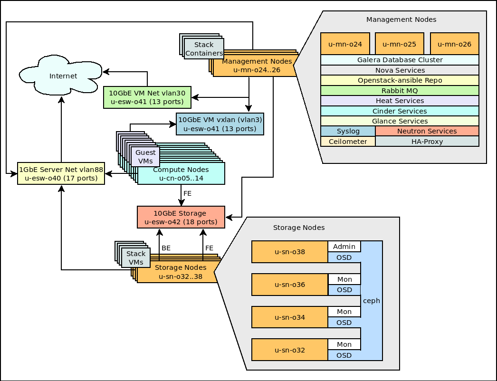

# Openstack Newton Deployment at HPC2N

## General

Openstack Ansible was used for the Openstack deployment at HPC2N.

    git clone https://git.openstack.org/openstack/openstack-ansible
    git checkout stable/newton

Some region and federation bugs were reported to openstack-ansible during the install.
Make sure that you have the fixes for bug#1660322, bug#1660344, bug#1660626 and bug#1661197 before starting the deply.

If your openstack-ansible does not include fixes for them then you can download them from here

- [Fix for bug #1660322 and #1660344](bugfix/bug1660322_and_bug1660344_fix.tgz)
- [Fix for bug #1660626](bugfix/bug1660626_fix.tgz)
- [Fix for bug #1661197](bugfix/bug1661197_fix.tgz)

## System map

## Hardware setup

### Compute nodes x 10

- Dell PowerEdge R630
- 2 x 12 Core Intel(R) Xeon(R) CPU E5-2670 v3 @ 2.30GHz
- 128G RAM
- 2 x 300G SAS Disks in a RAID 1 mirror.

### Control nodes x 3

- Dell PowerEdge R630
- 1 x 8 Core Intel(R) Xeon(R) CPU E5-2630 v3 @ 2.40GHz
- 32G RAM
- 2 x 300G SAS Disks in a RAID 1 mirror.

### Storage nodes x 4

- HP ProLiant DL380e Gen8
- 2 x 4 Core Intel(R) Xeon(R) CPU E5-2407 0 @ 2.20GHz 
- 56G RAM
- 2 x 500G part of 4T SATA Disks in a RAID 1 mirror.
- 23T for Ceph storage*

Note*: Two storage nodes have 6 x 4T Disks, Two storage nodes have 5 x 4T Disks + 2 x 2T Disks. But the total amout of storage on the nodes are identical.

## Node setup

All nodes run Ubuntu 16.04 and they are installed with Puppet, the HPC2N standard for server installation.

### Compute node post puppet suff

All stuff is not yet fixed with puppet so after the initial installation of the host has completed we need to run some commands and then configure the networks.

    mkdir /openstack
    mkdir /var/lib/nova
    
    mkfs.xfs /dev/rootvg/openstacklv
    mkfs.xfs /dev/rootvg/novalv
    
    cat - >> /etc/fstab <<EOF
    /dev/rootvg/openstacklv	/openstack	xfs	nodev	0 2
    /dev/rootvg/novalv	/var/lib/nova	xfs	nosuid,nodev	0 2
    EOF
    
    mount -a
    
    cat - > /etc/apt/sources.list <<EOF
    ###### Ubuntu Main Repos
    deb http://archive.ubuntu.com/ubuntu/ xenial main restricted universe multiverse
    ###### Ubunt:u Update Repos
    deb http://archive.ubuntu.com/ubuntu/ xenial-security main restricted universe multiverse
    deb http://archive.ubuntu.com/ubuntu/ xenial-updates main restricted universe multiverse
    EOF
    
    
    echo 'bonding' >> /etc/modules
    echo '8021q' >> /etc/modules
    
    apt-get install -y bridge-utils debootstrap ifenslave ifenslave-2.6 lsof lvm2 ntp openssh-server sudo tcpdump vlan
    
    perl -pi -e 's,(.*?/varlv.*?\s+)(nosuid\,nodev),$1 defaults,' /etc/fstab
    perl -pi -e 's,/home/syslog,/var/spool/rsyslog,' /etc/passwd

    mount -o remount /var

#### Old Abisko nodes only

    apt-get install -y libmlx4-1 ibverbs-utils infiniband-diags python-libxml2

    cd /afs/hpc2n.umu.se/lap/mlnx-ofed/3.3/src/MLNX_OFED_SRC-3.3-1.0.4.0/SOURCES/xenial/

    dpkg -i mlnx-ofed-kernel-dkms_3.3-OFED.3.3.1.0.4.1.gcd30181.hpc2n01_all.deb mlnx-ofed-kernel-utils_3.3-OFED.3.3.1.0.4.1.gcd30181.hpc2n01_amd64.deb

    echo mlx4_vnic >> /etc/modules

    systemctl enable openibd

    /etc/init.d/openibd start

### Management node post puppet suff

All stuff is not yet fixed with puppet so after the initial installation of the host has completed we need to run some commands and then configure the networks.

    mkdir /openstack
    
    lvcreate -n openstacklv -L20G lxc
    
    mkfs.xfs /dev/lxc/openstacklv
    cat - >> /etc/fstab <<EOF
    /dev/lxc/openstacklv	/openstack	xfs	nodev	0 2
    EOF
    
    mount -a
    
    cat - > /etc/apt/sources.list <<EOF
    ###### Ubuntu Main Repos
    deb http://archive.ubuntu.com/ubuntu/ xenial main restricted universe multiverse
    ###### Ubunt:u Update Repos
    deb http://archive.ubuntu.com/ubuntu/ xenial-security main restricted universe multiverse
    deb http://archive.ubuntu.com/ubuntu/ xenial-updates main restricted universe multiverse
    EOF
    
    
    echo 'bonding' >> /etc/modules
    echo '8021q' >> /etc/modules
    
    apt-get install -y bridge-utils debootstrap ifenslave ifenslave-2.6 lsof lvm2 ntp openssh-server sudo tcpdump vlan
    
    perl -pi -e 's,(.*?/varlv.*?\s+)(nosuid\,nodev),$1 defaults,' /etc/fstab
    perl -pi -e 's,/home/syslog,/var/spool/rsyslog,' /etc/passwd

    mount -o remount /var

## Openstack Ansible

The storage node u-sn-o38 is also used as deployment-host for openstack-ansible.
Kerberos is used for access to destination hosts. SSH-Keys are used for containers.

The rest of the setup follows openstack-ansible refrence manual for installation.

The following configuraton files were used for deployment.

- [openstack_user_config.yml](hpc2n_conf/openstack_user_config.yml)
- [user_variables.yml](hpc2n_conf/user_variables.yml)

## Network

Linux-bridges are used for the for the vlan and vxlan traffic.

### Compute node interfaces

/etc/network/interfaces.d/bridge.interfaces

    auto eno1
    iface eno1 inet manual
    
    # Container management VLAN interface
    auto eno1.10
    iface eno1.10 inet manual
        vlan-raw-device eno1
    
    auto eno2
    iface eno2 inet manual
    
    # OpenStack Networking VXLAN (tunnel/overlay) VLAN interface
    auto eno2.20
    iface eno2.20 inet manual
        vlan-raw-device eno2
    
    # Container management bridge
    auto br-mgmt
    iface br-mgmt inet static
        bridge_stp off
        bridge_waitport 0
        bridge_fd 0
        # Bridge port references tagged interface
        bridge_ports eno1.10
        address 172.16.2.3X
        netmask 255.255.255.0
    
    # OpenStack Networking VXLAN (tunnel/overlay) bridge
    auto br-vxlan
    iface br-vxlan inet static
        bridge_stp off
        bridge_waitport 0
        bridge_fd 0
        # Bridge port references tagged interface
        bridge_ports eno2.20
        address 10.10.0.3X
        netmask 255.255.0.0
    
    # OpenStack Networking VLAN bridge
    auto br-vlan
    iface br-vlan inet manual
        bridge_stp off
        bridge_waitport 0
        bridge_fd 0
        # Bridge port references untagged interface
        bridge_ports eno2
    
    auto br-storage
    iface br-storage inet static
        # Completely disable IPv6 router advertisements/autoconfig
        pre-up sysctl -q -e -w net/ipv6/conf/br-storage/accept_ra=0
        bridge_stp off
        bridge_waitport 0
        bridge_fd 0
        bridge_ports eno1
        address 172.16.1.3X
        netmask 255.255.255.0
        broadcast 172.16.1.255

- u-cn-o05 has IP suffix .30
- u-cn-o06 has IP suffix .31
- u-cn-o07 has IP suffix .32
- u-cn-o10 has IP suffix .33
- u-cn-o11 has IP suffix .34
- u-cn-o12 has IP suffix .35
- u-cn-o13 has IP suffix .36
- u-cn-o14 has IP suffix .37

### Management node interfaces

/etc/network/interfaces.d/bridge.interfaces

    # Container management VLAN interface
    iface bond0.10 inet manual
        vlan-raw-device bond0
    
    # OpenStack Networking VXLAN (tunnel/overlay) VLAN interface
    iface bond1.20 inet manual
        vlan-raw-device bond1
    
    # Container management bridge
    auto br-mgmt
    iface br-mgmt inet static
        bridge_stp off
        bridge_waitport 0
        bridge_fd 0
        # Bridge port references tagged interface
        bridge_ports bond0.10
        address 172.16.2.X
        netmask 255.255.255.0
    
    # OpenStack Networking VXLAN (tunnel/overlay) bridge
    auto br-vxlan
    iface br-vxlan inet manual
        bridge_stp off
        bridge_waitport 0
        bridge_fd 0
        # Bridge port references tagged interface
        bridge_ports bond1.20
    
    # OpenStack Networking VLAN bridge
    auto br-vlan
    iface br-vlan inet manual
        bridge_stp off
        bridge_waitport 0
        bridge_fd 0
        # Bridge port references untagged interface
        bridge_ports bond1
    
    auto br-storage
    iface br-storage inet static
        bridge_stp off
        bridge_waitport 0
        bridge_fd 0
        bridge_ports bond0
        address 172.16.1.X
        netmask 255.255.255.0

- u-mn-o24 has IP suffix .2
- u-mn-o25 has IP suffix .3
- u-mn-o26 has IP suffix .4

/etc/network/interfaces.d/bond0.interfaces

    auto eno1
    iface eno1 inet manual
        bond-master bond0
    
    auto enp3s0f0
    iface enp3s0f0 inet manual
        bond-master bond0
    
    auto bond0
    iface bond0 inet manual
        bond-slaves eno1 enp3s0f0
        bond-mode active-backup
        bond-miimon 100
        bond-downdelay 200
        bond-updelay 200

/etc/network/interfaces.d/bond1.interfaces

    auto eno2
    iface eno2 inet manual
        bond-master bond1
    
    auto enp3s0f1
    iface enp3s0f1 inet manual
        bond-master bond1
    
    auto bond1
    iface bond1 inet manual
        bond-slaves eth1 eth3
        bond-mode active-backup
        bond-miimon 100
        bond-downdelay 250
        bond-updelay 250

### Floating IPv4 Pool

The floating IPv4 network pool is a full class C network (130.239.81.0/24) with the gateway 130.239.81.254.

    neutron net-create "Public External IPv4 Network" --shared --router:external=True --provider:network_type vlan --provider:segmentation_id 3 --provider:physical_network vlan
    neutron subnet-create  --allocation-pool start=130.239.81.1,end=130.239.81.253 --gateway 130.239.81.254 --disable-dhcp --name "Public External IPv4 Subnet" --ip-version 4 --dns-nameserver 130.239.1.90 "Public External IPv4 Network" 130.239.81.0/24

### IPv6 Networking using external DHCPv6

We have a very large IPv6 network (2001:6b0:e:4081::/64) for the cloud and the IPv6 addresses are assigned with SLAAC from the external router.

Currently it is one large shared network but we will try to use prefix deligation to get a subnet for each project later.

    neutron net-create "Public External IPv6 Network" --shared --provider:network_type vlan --provider:segmentation_id 5 --provider:physical_network vlan
    neutron subnet-create --ipv6_address_mode=slaac --name "Public External IPv6 Subnet" --ip-version 6 --dns-nameserver 2001:6b0:e:5::2 "Public External IPv6 Network" 2001:6b0:e:4081::/64

## Galera

### Galera backup

Create a backup script in all galera containers

    cat - <<EOF > /etc/cron.hourly/mysqldump
    #!/bin/sh
    /usr/bin/mysqldump --single-transaction --all-databases | /bin/gzip -c > /var/backup/sqldump.`date +"%H"`.sql.gz
    EOF

    chmod +x /etc/cron.hourly/mysqldump

## Ceilometer

### Setup mogoDB

MongoDB is not setup by the openstack ansible scripts

The mongoDB dabase is installed on the controller node u-mn-24 using the following commands

    apt-get install mongodb-server mongodb-clients python-pymongo
    sed -i 's/127.0.0.1/172.16.2.2/g' /etc/mongodb.conf
    echo smallfiles = true >> /etc/mongodb.conf
    service mongodb restart

Get **CEILOMETER_DBPASS** from `ceilometer_container_db_password` in `/etc/openstack_deploy/user_secrets.yml` on deploy host `u-sn-o38`

    mongo --host 172.16.2.2 --eval '
    db = db.getSiblingDB("ceilometer");
    db.addUser({user: "ceilometer",
    pwd: "**CEILOMETER_DBPASS**",
    roles: [ "readWrite", "dbAdmin" ]})'

### Database cleanup

Configure how long the samples and events should be stored in the database.

We will only keep them for 7 days.

On the deploy host edit /etc/ansible/roles/os_ceilometer/templates/ceilometer.conf.j2. Add metering_time_to_live and event_time_to_live

    --- ceilometer.conf.j2.old	2017-02-14 11:25:45.470152855 +0100
    +++ ceilometer.conf.j2.new	2017-02-14 11:25:54.481702171 +0100
    @@ -106,6 +106,8 @@
     [database]
     metering_connection = {{ ceilometer_connection_string }}
     event_connection = {{ ceilometer_connection_string }}
    +metering_time_to_live = {{ ceilometer_metering_time_to_live }}
    +event_time_to_live = {{ ceilometer_event_time_to_live }}
     
     
      [dispatcher_gnocchi]

Edit your user_variables.yml and add the variables

    ceilometer_metering_time_to_live: 604800
    ceilometer_event_time_to_live: 604800

## Horizon

### "Drop down" patch for regions

Multi-keystone region support in horizon does not work with saml2.
To "fix" this we need to replace a file in all horizon containsers.

Run the following commands in all horizon containers.

    cp /openstack/venvs/horizon-14.0.7/lib/python2.7/site-packages/horizon/templates/horizon/common/_region_selector.html /openstack/venvs/horizon-14.0.7/lib/python2.7/site-packages/horizon/templates/horizon/common/_region_selector.html.`date +"%Y%m%d"`

    REGION=HPC2N

    cat - <<EOF > /openstack/venvs/horizon-14.0.7/lib/python2.7/site-packages/horizon/templates/horizon/common/_region_selector.html
    
    
      <a href="#" class="dropdown-toggle" data-toggle="dropdown" role="button" aria-expanded="false">
        $REGION
        
      </a>
      <ul id="region_list" class="dropdown-menu dropdown-menu-left">
           <li class="dropdown-header"></li>
           <li>
             <a href="https://c3se.cloud.snic.se/project">
               C3SE
             </a>
           </li>
           <li>
             <a href="https://hpc2n.cloud.snic.se/project">
               HPC2N
             </a>
           </li>
      </ul>
    EOF

### Move dropdown to the left

The region dropdown is hard to see all the way to the left so we move it to the right.

Patch /openstack/venvs/horizon-14.0.7/lib/python2.7/site-packages/openstack_dashboard/templates/header/_header.html

    --- header/_header.html.orig	2017-02-21 11:13:12.357429096 +0100
    +++ header/_header.html	2017-02-21 11:17:19.858355731 +0100
    @@ -26,11 +26,11 @@
         

           <ul class="nav navbar-nav">
             
    +        
           </ul>
     
           <ul class="nav navbar-nav navbar-right">
             
    -        
           </ul>
         
<!-- /.navbar-collapse -->
       
<!-- /.container-fluid -->

### Fix for broken POLICY_CHECK_FUNCTION check

The version of horizon checked out by openstack-ansible has a bug causing the Admin panel to show for non admin users.

This bug is solved in later versions of horizon but you can do a quickfix by editing /openstack/venvs/horizon-14.0.7/lib/python2.7/site-packages/openstack_dashboard/dashboards/admin/dashboard.py

Replace

    class Admin(horizon.Dashboard):
        name = _("Admin")
        slug = "admin"

        if getattr(settings, 'POLICY_CHECK_FUNCTION', None):
            policy_rules = (('identity', 'admin_required'),
                            ('image', 'context_is_admin'),
                            ('volume', 'context_is_admin'),
                            ('compute', 'context_is_admin'),
                            ('network', 'context_is_admin'),
                            ('orchestration', 'context_is_admin'),)
        else:
            permissions = (tuple(utils.get_admin_permissions()),)

With

    class Admin(horizon.Dashboard):
        name = _("Admin")
        slug = "admin"

        permissions = (tuple(utils.get_admin_permissions()),)

### Remove Download of RCv2 from Access & Security page

We do not support v2 authentication. Remove it so the users do not get confused.

Edit /openstack/venvs/horizon-14.0.7/lib/python2.7/site-packages/openstack_dashboard/dashboards/project/access_and_security/api_access/tables.py

    --- tables.py.orig	2017-02-28 14:06:18.204843707 +0100
    +++ tables.py	2017-02-28 14:06:28.876881488 +0100
    @@ -107,5 +107,5 @@
             name = "endpoints"
             verbose_name = _("API Endpoints")
             multi_select = False
    -        table_actions = (DownloadOpenRCv2, DownloadOpenRC, DownloadEC2,
    +        table_actions = (DownloadOpenRC, DownloadEC2,
                              ViewCredentials, RecreateCredentials)

## Glance

### Flavors

Flavors are sorted by the ID, so set them in the correct order.

    openstack flavor create --ram 512 --disk 1 --vcpus 1 --id 8c704ef9-74dc-495e-9e2b-baebc6775b16 --public ssc.tiny
    openstack flavor create --ram 2048 --disk 20 --vcpus 1 --id 8d704ef9-74dc-495e-9e2b-baebc6775b16 --public ssc.small
    openstack flavor create --ram 4096 --disk 40 --vcpus 2 --id 8e704ef9-74dc-495e-9e2b-baebc6775b16 --public ssc.medium
    openstack flavor create --ram 8192 --disk 80 --vcpus 4 --id 8f704ef9-74dc-495e-9e2b-baebc6775b16 --public ssc.large
    openstack flavor create --ram 16384 --disk 160 --vcpus 8 --id 90704ef9-74dc-495e-9e2b-baebc6775b16 --public ssc.xlarge

### Images

The images are kept up to date using a cronjob and a [bash script](scripts/update_images_1.2.tgz)

## Quota

We have made some changes to the default quota

    nova quota-class-update default --cores 128
    nova quota-class-update default --instances 64
    nova quota-class-update default --ram 65536
    nova quota-class-update default --server-group-members 64
    nova quota-class-update default --server-groups 32
    cinder quota-class-update default --volumes 32
    
Number of floating ips is limited from 50 to 5 in user_varibables.yml

    neutron_quota_floatingip: 5

## RadosGW for Ceph Object-Store

### Extra container on the mgmt-nodes.

A new container has been created for the ceph-rados gateway.

Using openstack ansible a container with the name radosgw_container is created by creating the the config file [radosgw_container.yml](hpc2n_conf/radosgw_container.yml) in the /etc/openstack_deploy/env.d/ directory on the ansible deploy host.

To make it available there is a section "radosgw_hosts:" in the [openstack_user_config.yml](hpc2n_conf/openstack_user_config.yml) file and config for haproxy configuration in the "haproxy_extra_services:" section fo the [user_variables.yml](hpc2n_conf/user_variables.yml) file.

Then run the playbooks to install the containers and haproxy-changes.

	openstack-ansible setup-hosts.yml --limit radosgw_all
	openstack-ansible setup-infrastructure.yml --limit radosgw_all
	openstack-ansible setup-infrastructure.yml --limit haproxy_all

### Creating the pools and users in ceph for object-store

To create the object store pools, run these commands on any storage node. Adjust the pg-num and pgp-num values from 64 to whatever is a good value for your ceph osd count.

    ceph osd pool create .rgw.root 64 64
    ceph osd pool create default.rgw.control 64 64
    ceph osd pool create default.rgw.data.root 64 64
    ceph osd pool create default.rgw.log 64 64
    ceph osd pool create default.rgw.intent-log 64 64
    ceph osd pool create default.rgw.gc 64 64
    ceph osd pool create default.rgw.users.uid 64 64
    ceph osd pool create default.rgw.usage 64 64
    ceph osd pool create default.rgw.users.keys 64 64
    ceph osd pool create default.rgw.users.email 64 64
    ceph osd pool create default.rgw.users.swift 64 64
    ceph osd pool create default.rgw.users.uid 64 64
    ceph osd pool create default.rgw.buckets.index 64 64
    ceph osd pool create default.rgw.buckets.data 64 64
    ceph osd pool create default.rgw.meta 64 64

Inititate the objectstore

    radosgw-admin realm create --rgw-realm=default --default
    radosgw-admin zonegroup create --rgw-zonegroup=default --rgw-realm=defalut--master --default
    radosgw-admin zone create --rgw-zonegroup=default --master --default --rgw-zone=default --endpoints "http://172.16.1:6000,https://hpc2n.cloud.snic.se:6000"
    radosgw-admin period update --commit

radosgw-admin zone create --rgw-zone=default --

Create a user for radosgw.
I do not like the permissions but my attemts to limit the permissons have not worked.

    ceph-authtool -C -n client.radosgw.gateway --gen-key /etc/ceph/ceph.client.radosgw.gateway.keyring
    ceph-authtool -n client.radosgw.gateway --cap mon 'allow rw' --cap osd 'allow rwx' /etc/ceph/ceph.client.radosgw.gateway.keyring
    ceph auth add client.radosgw.gateway --in-file=/etc/ceph/ceph.client.radosgw.gateway.keyring

### Crete a service user for the object-store in OpenStack Keystone

Take note of the password since you will be using that in your ceph.conf in the radosgw containers.

    openstack user create ceph --password-prompt
    openstack role add --user ceph --project admin admin

### Install RadosGW on the containers

For all of the radosgw_containers you need to install and configure radosgw, so attach the container and run the commands within the container.

Install required packages
    apt-get install radosgw radosgw-agent apache2 libapache2-mod-fastcgi curl

Create the config for apache

    cat - > /etc/apache2/sites-available/rgw.conf <<EOF
    <VirtualHost *:80>
    ServerName localhost
    DocumentRoot /var/www/
    ErrorLog /var/log/apache2/error.log
    CustomLog /var/log/apache2/access.log combined
    RewriteEngine On
    RewriteRule .* - [E=HTTP_AUTHORIZATION:%{HTTP:Authorization},L]
    SetEnv proxy-nokeepalive 1
    ProxyPass / unix:///var/run/ceph/ceph.radosgw.gateway.fastcgi.sock|fcgi://localhost:9000/
    </VirtualHost>
    EOF

From the storage node where you created the user copy these files to the same location in the container.

    /etc/ceph/ceph.client.radosgw.gateway.keyring
    /etc/ceph/ceph.conf

Fix permissons and owner

    chown root:root /etc/ceph/ceph.*
    chmod 640 /etc/ceph/ceph.*

Enable modules and rgw site, disable the default website.

    a2enmod rewrite
    a2enmod proxy_fcgi
    a2ensite rgw.conf
    a2dissite 000-default

Add the radosgw parts to ceph.conf, change EDIT_PASSWORD to the password used when creating the ceph service user and rgw dns name to your region dns name.

    cat - >> /etc/ceph/ceph.conf <<EOF
    [client.radosgw.gateway]
    host = `hostname`
    keyring = /etc/ceph/ceph.client.radosgw.gateway.keyring
    rgw socket path = /var/run/ceph/ceph.radosgw.gateway.fastcgi.sock
    rgw print continue = false
    log file = /var/log/radosgw/client.radosgw.log
    rgw dns name = hpc2n.cloud.snic.se
    rgw keystone url = http://172.16.2.1:35357
    rgw keystone admin user = ceph
    rgw keystone admin password = EDIT_PASSWORD
    rgw keystone admin project = admin
    rgw keystone admin domain = default
    rgw keystone accepted roles = _member_, admin
    rgw keystone api version = 3
    rgw enable usage log = truA
    rgw usage log tick interval = 30
    rgw usage log flush threshold = 1024
    rgw usage max shards = 32
    rgw usage max user shards = 1
    EOF

## Make sure www-data can read socket

    chmod a+xr /var/run/ceph 

## Enable and restart services

    systemctl enable radosgw
    systemctl restart radosgw
    systemctl enable apache2
    systemctl restart apache2

## Test that it works.

    curl localhost --header 'Host: hpc2n.cloud.snic.se'

 Should be an xml response with owner anonymous like

    <?xml version="1.0" encoding="UTF-8"?><ListAllMyBucketsResult xmlns="http://s3.amazonaws.com/doc/2006-03-01/"><Owner><ID>anonymous</ID><DisplayName></DisplayName></Owner><Buckets></Buckets></ListAllMyBucketsResult>

Then continue with the next container until all radowsgw containers are installed and working.

### Create a swift endpoint in OpenStack Keystone 

Change hpc2n.cloud.snic.se and 172.16.2.1 to whatever addresses is used in your region.

    openstack service create --name swift --description "object store service" object-store
    openstack endpoint create --region HPC2N object-store public https://hpc2n.cloud.snic.se:6000/swift/v1
    openstack endpoint create --region HPC2N object-store internal http://172.16.2.1:6000/swift/v1
    openstack endpoint create --region HPC2N object-store admin http://172.16.2.1:6000/swift/v1

## Ceilometer for RadosGW

### Create a admin user in the object store for the ceilometer service

If you want to be able to fetch usage with ceilometer you will need to create a user 

    radosgw-admin user create --uid admin --display-name "admin user" --caps "usage=read,write;metadata=read,write;users=read,write;buckets=read,write"

Take note of the access_key och secret_key, since these will be used in the ceilometer.conf file in the ceilometer containers.

### Modify the ceilometer containers

You need to add the radosgw config to the [default] section of /etc/ceilometer/ceilometer.conf in the ceilometer containers and this is where you will be using the keys created before.

    radosgw = object-store
    
    [rgw_admin_credentials]
    access_key = ACCESS_KEY
    secret_key = SECRET_KEY

Since awsauth is used for polling you need to install that. However you only need to do this in the ceilometer_api container.
In the containers pip uses a local repository and openstack-ansible has deployed its own python, so because I am lazy I intalled the ubuntu package and linked it to the correct location (Ugly? Yes i know).

    apt-get install python-awsauth
    ln -s /usr/lib/python2.7/dist-packages/awsauth.py /openstack/venvs/ceilometer-14.0.7/lib/python2.7/

Then restart all the ceilometer containers.

